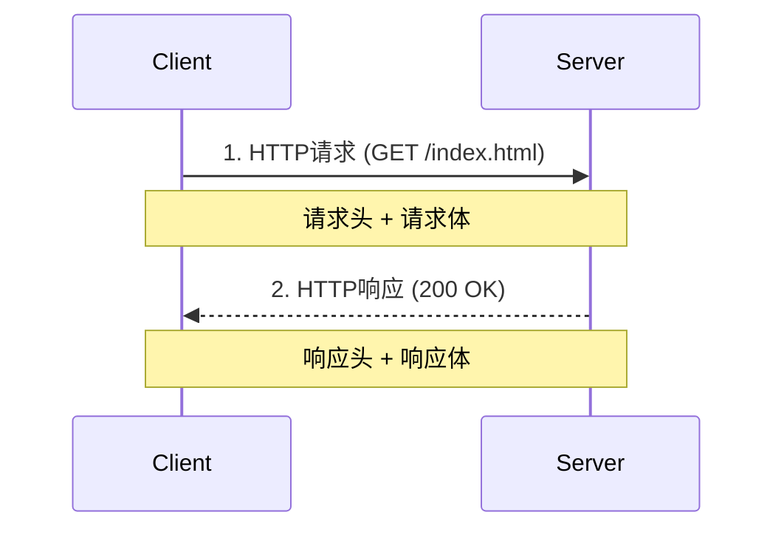

:::note
socket是一套用于不同主机间通信的API，它工作在TCP/IP协议栈之上，广泛应用于手机应用、SSH等。
:::
## TCP与UDP
### TCP
- TCP(Transmission Control Protocol/传输控制协议)是可靠的，发送的数据接收方一定可以收到
- TCP是基于数据流的协议，发送和接收到的数据顺序是完全一致的
- TCP要求收发数据的双方扮演不同角色：服务端和客户端
>服务端被动等待客户端连接，不会主动发起请求

### UDP
- UDP(`User Datagram Protocol/用户报文协议`)以报文为单位收发数据
- UDP不会自动回传丢失的数据包，不能保证接收方一定可以收到
- UDP通常具有更低的延迟并占用更少的系统资源
- 适用于视频语音通话等对实时性要求较高的应用

## socket实现
### 简单实现 
:::code-tabs
@tab server.py
```python
import socket

# AF_INET表示IPv4，SOCK_STREAM表示TCP（流式）协议
with socket.socket(socket.AF_INET, socket.SOCK_STREAM) as s:
    s.bind(("0.0.0.0", 1234))
    s.listen()
    c, addr = s.accept()    # s用于监听，c用于与连接的客户端进行通信
    with c:
        print(addr, "connected..")
        while True:
            data = c.recv(1024)
            if not data:
                break
            c.sendall(data)
```
@tab client.py
```python
import socket

with socket.socket(socket.AF_INET, socket.SOCK_STREAM) as s:
    s.connect(("127.0.0.1", 1234))
    s.sendall(b"Hello, Lee!")
    data = s.recv(1024)
    print(repr)
```
:::

### 多线程Socket服务器
:::code-tabs
@tab server.py
```python
import socket
import threading

def handle_client(c, addr):
    print(addr, "connected..")
    while True:
        data = c.recv(1024)
        if not data:
            break
        c.sendall(data)

# AF_INET表示IPv4，SOCK_STREAM表示TCP（流式）协议
with socket.socket(socket.AF_INET, socket.SOCK_STREAM) as s:
    s.bind(("0.0.0.0", 1234))
    s.listen()
    while True:
        c, addr = s.accept()
        t = threading.Thread(target=handle_client, args=(c, addr))
        t.start()
```
@tab client.py
```python
import socket

with socket.socket(socket.AF_INET, socket.SOCK_STREAM) as s:
    s.connect(("127.0.0.1", 1234))
    while True:
        str = input()
        s.sendall(str.encode())
        data = s.recv(1024)
        print(repr(data))
```
:::

### 简易HTTP协议
- HTTP是TCP协议的一个典型应用，也是浏览器与服务器交互的主要方式
- 通常服务器会监听80端口，然后等待客户端连接
- 客户端在连接到服务器后，要指定访问的服务器资源

:::code-tabs
@tab server.py
```python
import socket
import threading

def handle_client(c, addr):
    print(addr, "connected..")
    with c:
        request = c.recv(1024)

        # Parse HTTP headers
        headers = request.split(b"\r\n")    # HTTP标准中定义的换行符是“回车+换行”(CR LF)
        file = headers[0].split()[1].decode()

        # Load file content
        if file == "/":
            file = "index.html"
        
        try:
            with open(file, "rb") as f:
                content = f.read()
            response = b"HTTP/1.0 200 OK\r\nContent-Type: text/html; charset=utf-8\r\n\r\n" + content
        except FileNotFoundError:
            response = b"HTTP/1.0 404 NOT FOUND\r\n\r\nFile not found!"
        
        # Send HTTP response
        c.sendall(response)


# AF_INET表示IPv4，SOCK_STREAM表示TCP（流式）协议
with socket.socket(socket.AF_INET, socket.SOCK_STREAM) as s:
    s.bind(("0.0.0.0", 1234))
    s.listen()
    while True:
        c, addr = s.accept()
        t = threading.Thread(target=handle_client, args=(c, addr))
        t.start()
```

@tab index.html
```html
<meta charset="UTF-8">
<h1>这是一个测试文件</h1>
```