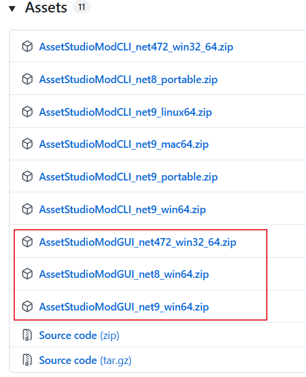
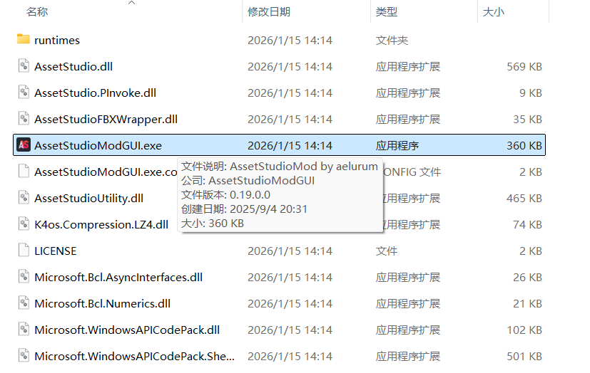
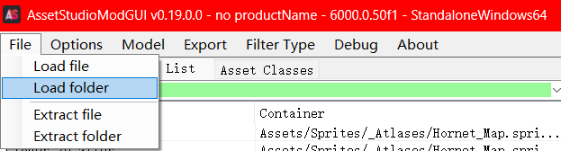
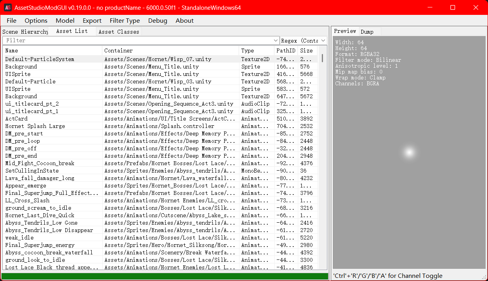
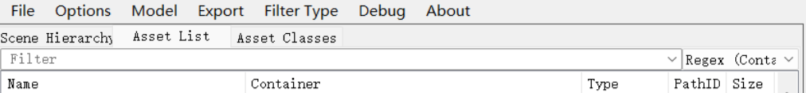
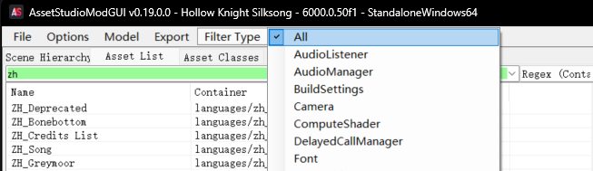
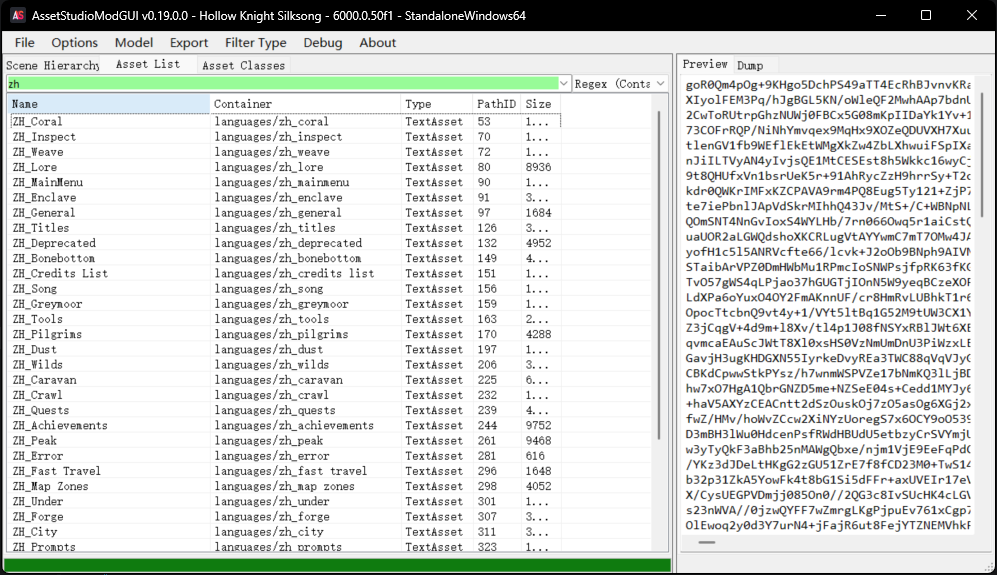
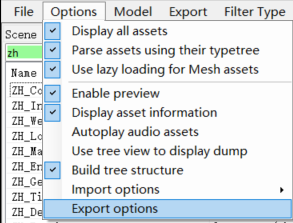

> 免责声明：本教程仅用于学习丝之歌游戏的代码，请勿用于商业用途

本文将主要介绍如何使用`AssetStudioMod`进行解包

---

### 需要用到的工具
#### AssetStudioMod
AssetStudioMod 是基于AssetStudio的修改版本，主要侧重于UI优化和一些功能增强，仍在更新中   
- 如何下载:
    1. 访问::mdi:github::[AssetStudioMod](https://github.com/aelurum/AssetStudio/releases)
    2. 访问::mdi:github::[AssetStudio](https://github.com/Perfare/AssetStudio/releases)，该项目为原项目，已经归档

---

### 解包流程
#### 配置AssetStudioMod
1. 下载AssetStudioModGUI，根据已有的NET版本安装对应的AssetStudioMod版本，若没有则去官网安装[.NET Framework](https://dotnet.microsoft.com/zh-cn/download/dotnet-framework)     

2. 下载后解压到任意目录，打开`AssetStudioModGUI.exe`即可使用   

---

#### 解包游戏资源
1. 打开AssetStudioModGUI，点击`Options` -> `Import options` ->`Specify Unity version`，设置为`6000.0.50f1`

2. 点击`File` -> `Load folder`      

3. 选择游戏目录下的`Hollow Knight Silksong\Hollow Knight Silksong_Data\StreamingAssets`文件夹   
   

4. 等待加载完成，即可在`Assets List`选项下下看到相应的资源

---

#### 预览资源
1. 点击`Assets List`选项下的资源，重点关注 `Name`,`Container`,`Type`这三个属性
    - Name: 顾名思义，资源的名称
    - Container: 容器，即资源位置
    - Type: 资源的类型
    
    

2. 如果要导出贴图相关内容，可以点击`Filter Type`选择`Sprite`和`Texture2D`类型

3. 如果要导出文本相关内容，可以点击`Filter Type`选择`TextAsset`类型     
    这里内容是base64加密过的字符串，可以使用[base64Tool](https://nov1ce-lee.github.io/base64Tool/)直接解密，也可以看[存档解析](2.存档解析.md)了解解密原理

#### 导出资源
1. 导出设置，一般设置根据`type name`分组导出，也可根据自己的需要     

2. 导出可选择所有素材资源，也可以根据你过滤的内容，也可以是选择的资源，配置导出地址后即可导出       

---

### 总结
仿照以上方式，我们基本上可以导出游戏的所有资源，包括贴图、文本、音频和脚本等，根据需要进行筛选和导出即可

同时该方式也支持空洞骑士一代的内容